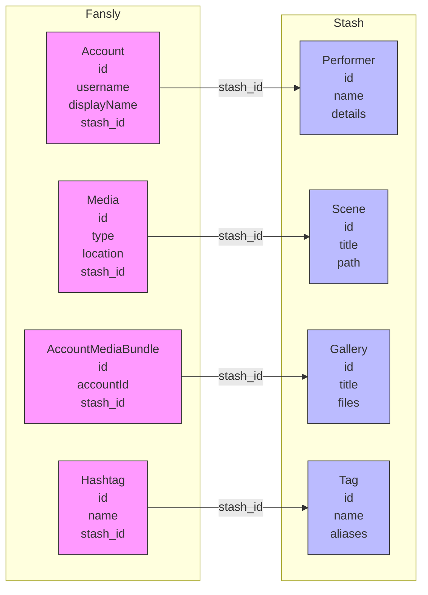
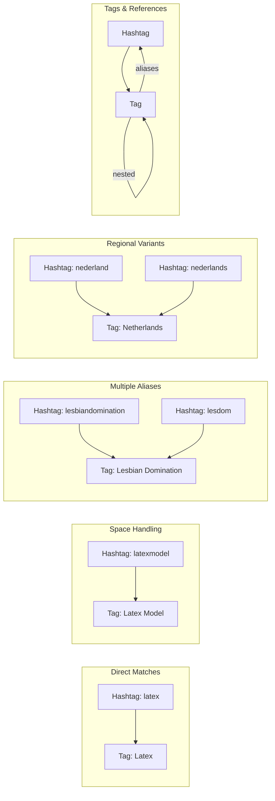
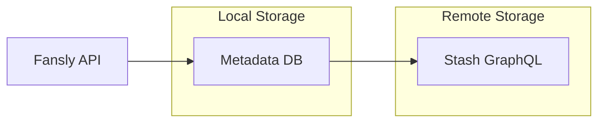
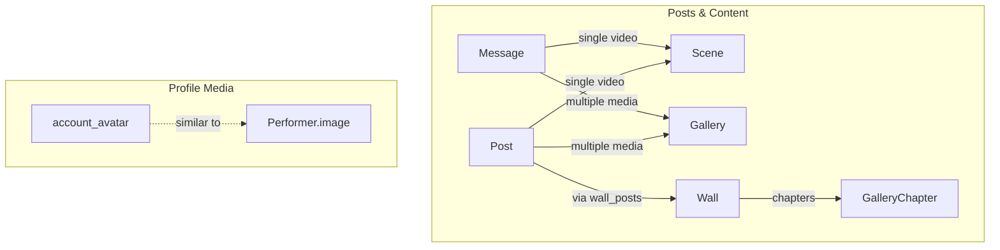
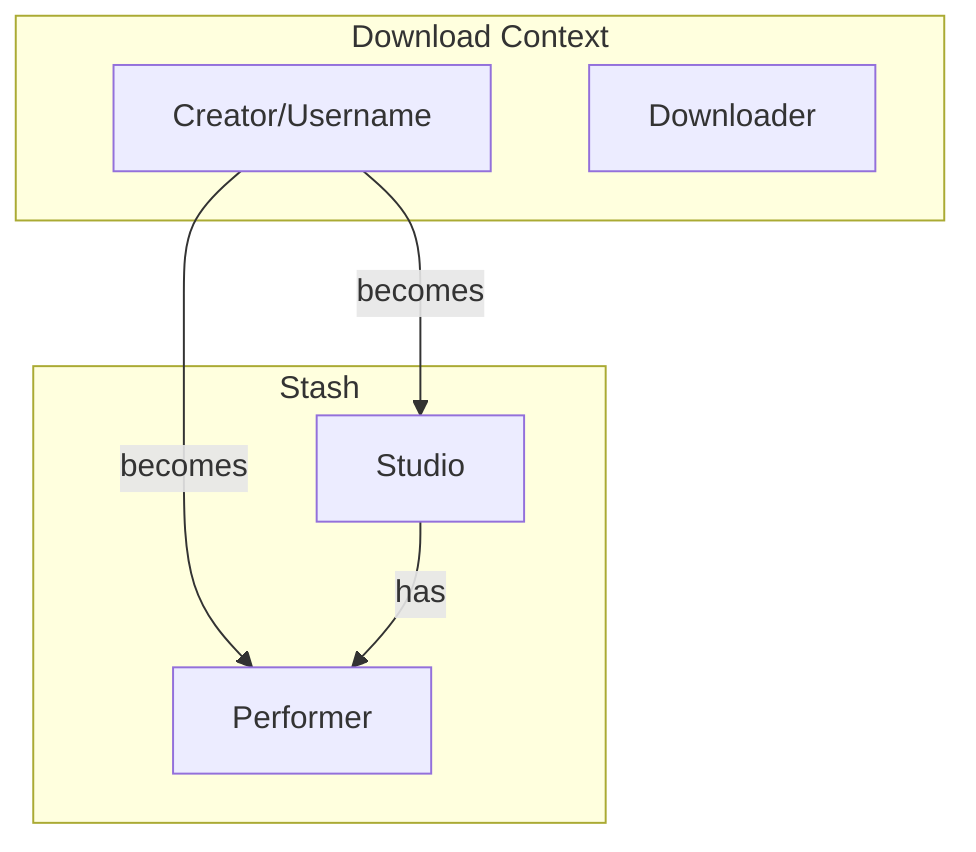
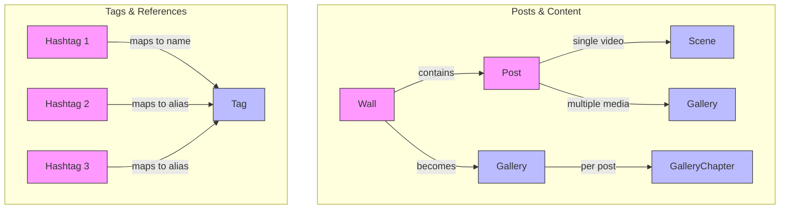

# Fansly to Stash Mapping

## Data Structure Overview

### Fansly Core Types

1. Account

   ```typescript
   {
     id: string; // e.g., "720167541418237953"
     username: string; // e.g., "trainingj"
     displayName: string | null; // e.g., "Training J"
     about: string | null; // Profile description
     location: string | null;
     flags: number;
     version: number;
     createdAt: number; // Unix timestamp
     following: boolean;
     avatar: Media | null;
     banner: Media | null;
     timelineStats: {
       imageCount: number;
       videoCount: number;
       bundleCount: number;
       bundleImageCount: number;
       bundleVideoCount: number;
     }
   }
   ```

2. Media

   ```typescript
   {
     id: string;
     type: number; // 1 = image, 2 = video
     status: number;
     accountId: string;
     mimetype: string; // e.g., "image/jpeg"
     flags: number;
     location: string; // Path to file
     width: number;
     height: number;
     metadata: string; // JSON string with additional info
     variants: Array<{
       // Different resolutions
       width: number;
       height: number;
       location: string;
     }>;
   }
   ```

3. Post

   ```typescript
   {
     id: string
     accountId: string
     content: string | null
     flags: number
     createdAt: number
     attachments: Media[]
     hashtags: Hashtag[]
   }
   ```

4. Message

   ```typescript
   {
     id: string
     groupId: string
     senderId: string
     content: string | null
     attachments: Media[]
     createdAt: number
   }
   ```

5. Wall

   ```typescript
   {
     id: string
     accountId: string
     description: string | null
     posts: Post[]
     createdAt: number
   }
   ```

### Fansly Relationships

1. Content Organization:

   - Account -> Posts (one-to-many)
   - Account -> Messages (one-to-many)
   - Account -> Walls (one-to-many)
   - Account -> Avatar/Banner (one-to-one)
   - Post -> Media (one-to-many)
   - Message -> Media (one-to-many)
   - Wall -> Posts (one-to-many)

2. Reference Relationships:

   - Media -> Account (many-to-one)
   - Post -> Account (many-to-one)
   - Message -> Account (many-to-one)
   - Wall -> Account (many-to-one)

3. Tag Relationships:
   - Post -> Hashtags (many-to-many)
   - Media -> Hashtags (many-to-many)
   - Account -> Hashtags (many-to-many)

## Core Entity Mappings



### Direct One-to-One Mappings

1. Account -> Performer

   - username -> name
   - displayName -> details
   - about -> details (appended)
   - avatar -> image

2. Media -> Scene/Image

   - id -> external_id
   - location -> path
   - type -> determines Scene vs Image
   - metadata -> details

3. Post -> Scene/Gallery
   - id -> external_id
   - content -> details
   - attachments -> files
   - createdAt -> created_at

### Similar/Indirect Mappings

1. Wall -> Gallery with Chapters

   - description -> details
   - posts -> chapters
   - Each post becomes a chapter

2. Message -> Scene/Gallery

   - content -> details
   - attachments -> files
   - Single video -> Scene
   - Multiple media -> Gallery

3. AccountMediaBundle -> Gallery
   - All media from bundle -> files
   - Bundle info -> details

## Tag System

### Tag/Hashtag Relationships



Key characteristics:

- Hashtags cannot contain spaces, but Stash Tags can
- A hashtag can map to either:
  - A Tag's primary name (direct match)
  - A Tag's alias (indirect match)
- Examples:

  - Direct primary name matches:

    ```python
    Hashtag(name="latex") -> Tag(name="Latex")
    ```

  - Space handling:

    ```python
    Hashtag(name="latexmodel") -> Tag(name="Latex Model", aliases=["latexmodel"])
    ```

  - Multiple hashtags to one tag via aliases:

    ```python
    Hashtag(name="lesbiandomination") -> Tag(name="Lesbian Domination", aliases=["lesbiandomination", "lesdom"])
    Hashtag(name="lesdom") -> Tag(name="Lesbian Domination", aliases=["lesbiandomination", "lesdom"])
    ```

  - Regional variants:

    ```python
    Hashtag(name="nederland") -> Tag(name="Netherlands", aliases=["nederland", "nederlands"])
    ```

### Tag Matching Rules

1. Direct Primary Name Matches

   - Case-insensitive matching (e.g., "latex" -> "Latex")
   - Similar concepts might be separate tags (e.g., "latexmodel" -> "LatexModel")

2. Alias Matches

   - Hashtags can match Tag aliases
   - Multiple hashtags can map to same Tag via aliases
   - Regional/language variants (e.g., "nederland", "nederlands" -> "Netherlands")
   - Common abbreviations (e.g., "lesdom" -> "Lesbian Domination")
   - Tags can have aliases that don't match any hashtags (e.g., "rubber" for "Latex")

3. Space Handling

   - Hashtags: Cannot contain spaces
   - Tags: Both name and aliases can contain spaces
   - Example: "latexmodel" hashtag -> "Latex Model" tag

4. Hierarchical Relationships
   - Only in Stash Tags (not in Fansly hashtags)
   - Parent/child relationships
   - Example: "Stockings" parent of "Fishnets"

### Tag/Hashtag Examples

```python
# Fansly side - hashtags cannot contain spaces
hashtags = [
    Hashtag(name="latex"),           # Maps to Tag "Latex"
    Hashtag(name="latexmodel"),      # Could map to various Tags (see below)
    Hashtag(name="latexfetish"),     # Maps to Tag "Latex Fetish"
    Hashtag(name="lesbiandomination"), # Maps to Tag "Lesbian Domination" via alias
    Hashtag(name="lesdom"),          # Maps to Tag "Lesbian Domination" via alias
    Hashtag(name="netherlands"),      # Maps to Tag "Netherlands"
    Hashtag(name="nederland"),       # Maps to Tag "Netherlands" via alias
    Hashtag(name="nederlands"),      # Maps to Tag "Netherlands" via alias
    Hashtag(name="stockings"),       # Maps to Tag "Stockings"
    Hashtag(name="fishnets"),        # Maps to Tag "Fishnets" (child of "Stockings")
]

# Stash side - both names and aliases can have spaces
tags = [
    Tag(
        name="Latex",  # Capitalized name
        aliases=["rubber", "Latex Clothing"],  # Alias with space
    ),
    Tag(
        name="Latex Model",  # Name with space
        aliases=["latexmodel", "Latex Models"],  # Mix of spaced and unspaced
    ),
    Tag(
        name="Latex Fetish",  # Name with space
        aliases=["Latex Fetishism"],  # Alias with space
    ),
    Tag(
        name="Lesbian Domination",
        aliases=["lesbiandomination", "lesdom"],  # Multiple hashtags map via aliases
    ),
    Tag(
        name="Netherlands",
        aliases=["nederland", "nederlands", "dutch"],  # Regional variants
    ),
    Tag(
        name="Stockings",  # Parent tag
        aliases=[],
    ),
    Tag(
        name="Fishnets",  # Child tag
        parent_tags=["Stockings"],  # Hierarchical relationship
        aliases=[],
    ),
]
```

## Implementation Strategy

### Database Integration

1. Metadata Module

   - Uses SQLAlchemy
   - On-disk/in-memory database with syncing
   - Handles local data persistence

2. Stash Module
   - GraphQL backend interface (`StashClient`)
   - Remote data source
   - Real-time data access

### Data Flow



### Field Selection Philosophy

1. Only store fields needed for:

   - Content identification
   - Relationship maintenance
   - Essential metadata
   - Stash integration

2. Omitted Fields:
   - UI-specific flags
   - Temporary state
   - Derived/calculated values
   - Access control (handled by Stash)
   - User preferences
   - Analytics/stats (except where needed)

### Stash Integration

Each mapped entity has:

```python
stash_id: Mapped[int | None] = mapped_column(Integer, nullable=True)
```

### Essential Fields

```python
# Account
class Account(Base):
    id: Mapped[int]                    # Primary key
    username: Mapped[str]              # Required for identification
    displayName: Mapped[str | None]    # Optional display name
    stash_id: Mapped[int | None]      # Link to Performer

# Media
class Media(Base):
    id: Mapped[int]                    # Primary key
    type: Mapped[int]                  # 1 = image, 2 = video
    location: Mapped[str]              # Path to file
    stash_id: Mapped[int | None]      # Link to Scene/Image
```

### Relationship Handling

1. Direct References:

   ```python
   class AccountMedia(Base):
       accountId: Mapped[int] = mapped_column(ForeignKey("accounts.id"))
       mediaId: Mapped[int] = mapped_column(ForeignKey("media.id"))
       stash_id: Mapped[int | None]  # Links to Scene/Image
   ```

2. Many-to-Many:

   ```python
   post_hashtags = Table(
       "post_hashtags",
       Base.metadata,
       Column("postId", Integer, ForeignKey("posts.id")),
       Column("hashtagId", Integer, ForeignKey("hashtags.id")),
   )
   ```

### Content Mapping Rules

1. Post to Scene:

   ```python
   class Post(Base):
       id: Mapped[int]
       content: Mapped[str | None]      # Becomes Scene.details
       attachments: Mapped[list[Media]] # Single video -> Scene
       stash_id: Mapped[int | None]    # Links to Scene

       def should_be_scene(self) -> bool:
           """Check if post should be a Scene."""
           if not self.attachments:
               return False
           if len(self.attachments) != 1:
               return False
           return self.attachments[0].type == MediaType.VIDEO
   ```

## Data Flow and Transformations



## Studio Context

### Studio Mapping



### Studio Organization

When in normal/timeline/message/wall download mode:

- Studio represents the creator/user being downloaded
- All content from that creator is linked to their Studio
- This helps organize content by source
- The Studio name matches the username from config
- Studio details include download source information

### Content Organization

1. By Creator:

   - Each creator gets their own Studio
   - All their content is linked to that Studio
   - Consistent naming and organization

2. By Content Type:
   - Scenes for videos
   - Galleries for images/sets
   - Each properly linked to Studio

### Studio Usage Example

```python
# Download configuration
config = FanslyConfig(
    user_names=["creator"],
    # ...
)

# Creates in Stash:
studio = Studio(
    name="creator",
    details="Content from creator on Fansly",
    parent_studio=None,  # Top-level studio
)

# All downloaded content gets linked
scene = Scene(
    title="Post 12345",
    studio=studio,
    path="/path/to/video.mp4",
)
```

## Database and File Organization

### Database Relationships

1. Direct References:

   ```python
   class AccountMedia(Base):
       accountId: Mapped[int] = mapped_column(ForeignKey("accounts.id"))
       mediaId: Mapped[int] = mapped_column(ForeignKey("media.id"))
       stash_id: Mapped[int | None]  # Links to Scene/Image
   ```

2. Many-to-Many:

   ```python
   post_hashtags = Table(
       "post_hashtags",
       Base.metadata,
       Column("postId", Integer, ForeignKey("posts.id")),
       Column("hashtagId", Integer, ForeignKey("hashtags.id")),
   )
   ```

### File Organization

1. Media Files:

   - Original files preserved
   - Variants stored with predictable naming
   - Path information stored in database
   - File integrity checked on import

2. Path Management:
   - Relative paths preferred
   - Absolute paths stored when needed
   - Path validation on import
   - Path normalization for cross-platform

## Notes

### Folder Usage

While not directly mapped, Folder in Stash might be useful for:

- Checking if Stash knows the path to a file
- Organizing content by source/creator
- Managing file system structure
- Tracking file locations

### Access Control

- Fansly access control not mapped to Stash
- PPV/subscription status tracked in metadata only
- All downloaded content accessible in Stash

### Data Integrity

- File checksums verified
- Metadata consistency checked
- Relationships validated
- Missing data handled gracefully

## Error Handling and Sync Management

### Error Types and Handling

1. Sync Errors:

   ```python
   class StashSyncError(Exception):
       """Error during Stash synchronization."""
       pass

   async def sync_to_stash(self) -> None:
       """Sync local changes to Stash with error handling."""
       if not self._dirty:
           return
       try:
           await self._sync()
           self._dirty = False
       except Exception as e:
           raise StashSyncError(f"Failed to sync {self}: {e}") from e
   ```

### Sync Management

1. State Tracking:

   ```python
   class SyncState:
       def __init__(self):
           self.last_sync = None
           self.pending = set()
           self.completed = set()
           self.failed = set()

       def mark_complete(self, task_id: str):
           self.pending.remove(task_id)
           self.completed.add(task_id)
           self.last_sync = datetime.now()
   ```

### Sync Strategies

1. Immediate Sync:

   ```python
   async def sync_now(self, obj: Base) -> None:
       """Immediate sync for critical updates."""
       await self.queue.put(SyncTask(
           obj=obj,
           priority=Priority.HIGH,
           retry_count=3,
       ))
   ```

2. Batch Sync:

   ```python
   async def batch_sync(self, objs: list[Base]) -> None:
       """Batch sync for efficiency."""
       async with self.batch_context() as batch:
           for obj in objs:
               batch.add(SyncTask(
                   obj=obj,
                   priority=Priority.NORMAL,
                   retry_count=1,
               ))
   ```



1. Posts to Scenes/Galleries:

   ```mermaid
   graph TD
       subgraph "Fansly Post"
           P[Post]
           C[Content/Text]
           H[Hashtags]
           A[Attachments]
       end

       subgraph "Stash Scene"
           S[Scene]
           D[Details]
           T[Tags]
           F[Files]
       end

       C -->|becomes| D
       H -->|become| T
       A -->|become| F
       P -->|links to| S
   ```

2. Messages to Scenes/Galleries:

   ```mermaid
   graph TD
       subgraph "Fansly Message"
           M[Message]
           C[Content]
           A[Attachments]
       end

       subgraph "Stash"
           S[Scene/Gallery]
           D[Details]
           F[Files]
       end

       C -->|becomes| D
       A -->|become| F
       M -->|links to| S
   ```

3. Wall to Gallery:

   ```mermaid
   graph TD
       subgraph "Fansly Wall"
           W[Wall]
           P[Posts]
           C[Content]
       end

       subgraph "Stash Gallery"
           G[Gallery]
           CH[Chapters]
           D[Details]
       end

       W -->|becomes| G
       P -->|becomes| G
       W --> P -->|if in a wall| CH
       C -->|becomes| D
   ```
